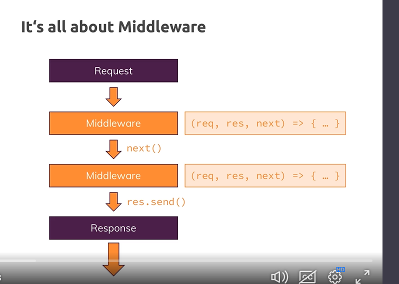
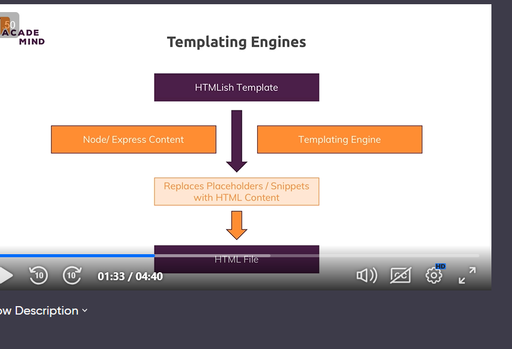

# Expressjs

- Dont reinvent the wheel (bakwaas you should reinvent wheel for better understanding)

- Server logic is complex (remember using http) see how did we parsed data

- We want to focus on business logic not small details most aof times

- Framework: helper functions, tools and rules helping to build our applications

- Alternatives: Adonis.js (laravel inspired), Koa, Sails.js

- Express is most popular

- 

- Generally speaking we dont want file system access through urls (express matches correct path)

- But we want to make some exceptions like linking styling pages in public directory, 

- Therefore we need some files to be handled staticcally (served statically)

- Which means not through express or its middlewares but direct access to file system

## Similarly we can serve images etc

# Rendering dynamic content and templates

- More than static html

- E.g rendering list of products from server
- Or showing the data which we entered

- Html pages with dynamic templates using templating engines

- There are many alternatives we will use 3 templating engines

1. Ejs  
 <%= name %> 

2. Pug(jade): p #{name} : (minimal html and cusoms template ennine)
3. Handlebars: 
 {{ name }} 
 closer to ejs philosphy(use normal htlm and custom but lesser )
- 

- Ejs doesnt support layouts (reusable component) but we will figure out workarounds (its like php)

- We can use partials and includes 

- we render the templates with special render method (which also takes data) and looks for engine which we set as view engine configuration and location where views are to be found which actually is default

- templating engine we installed seperately and then we just refer to view without extenstoin in render method and object of many  data (i have to try with functions and what will the context work as)

- Ejs simply detects <% - renders as html and = just as string>

- At the end we just get html code and it's done at server side not at browser side and our engines also do some caching if request is kinda same then send same template

# MVC Archetecure

- M: Section of code to represent your data in your code , work with our data save fetch etc

- Views : what users sees , decoupled from your application code

- Controllers connects models and our views as our views should not worry about how logic works

- Routes: upon which path, http method , which control code should work

- Controllers migh be split accross middleware functions

- 